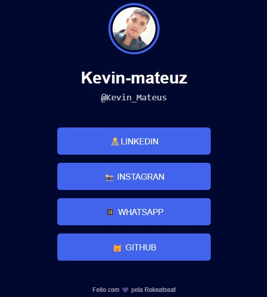

# Links-manager
 Links manager

 

 <a href="https://maneger-link.netlify.app/">Link do site

</a>

> o projeto se trata de um site onde os usuários poderão gerenciar seus links de suas redes sociais , assim facilitará seu engajamento de um modo prático e rápido.

<table>
  <tr>
    <td align="center">
      <a href="#">
         
        
          <b>Kevin Mateus</b>
        
      </a>
    </td>
   
</table> 